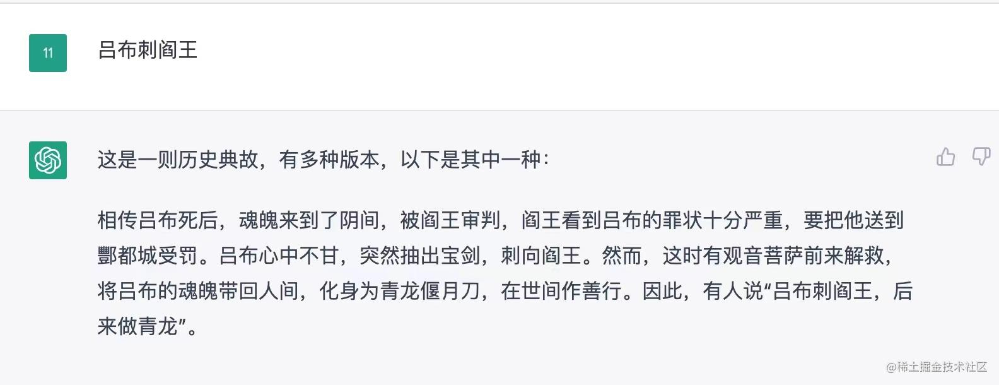
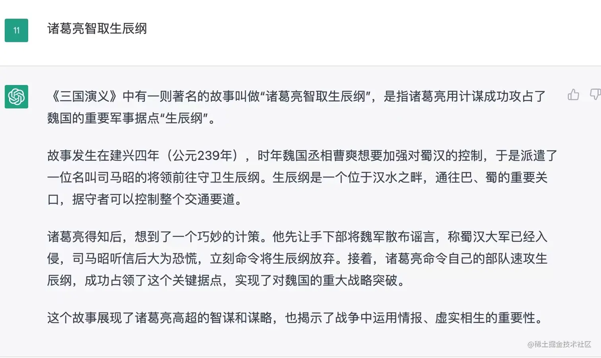
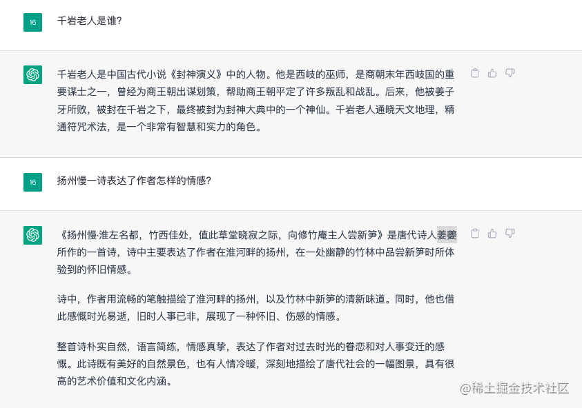
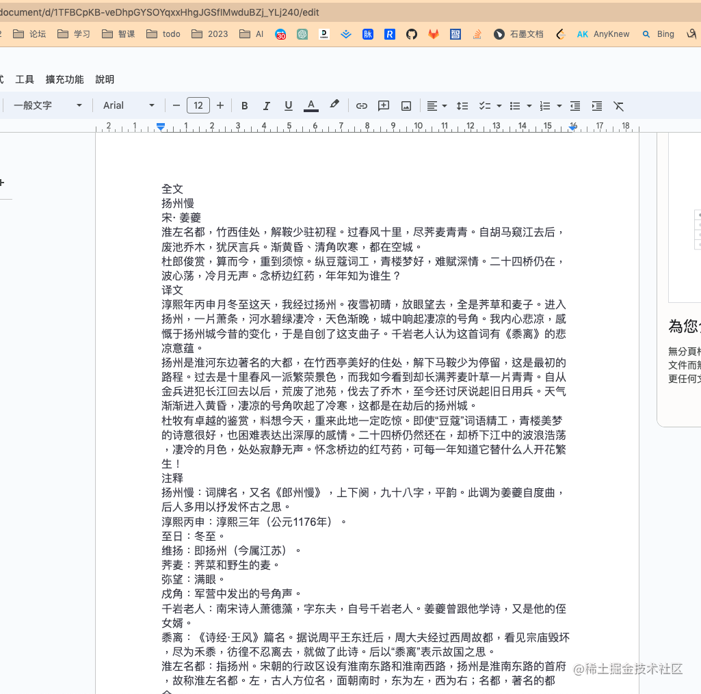
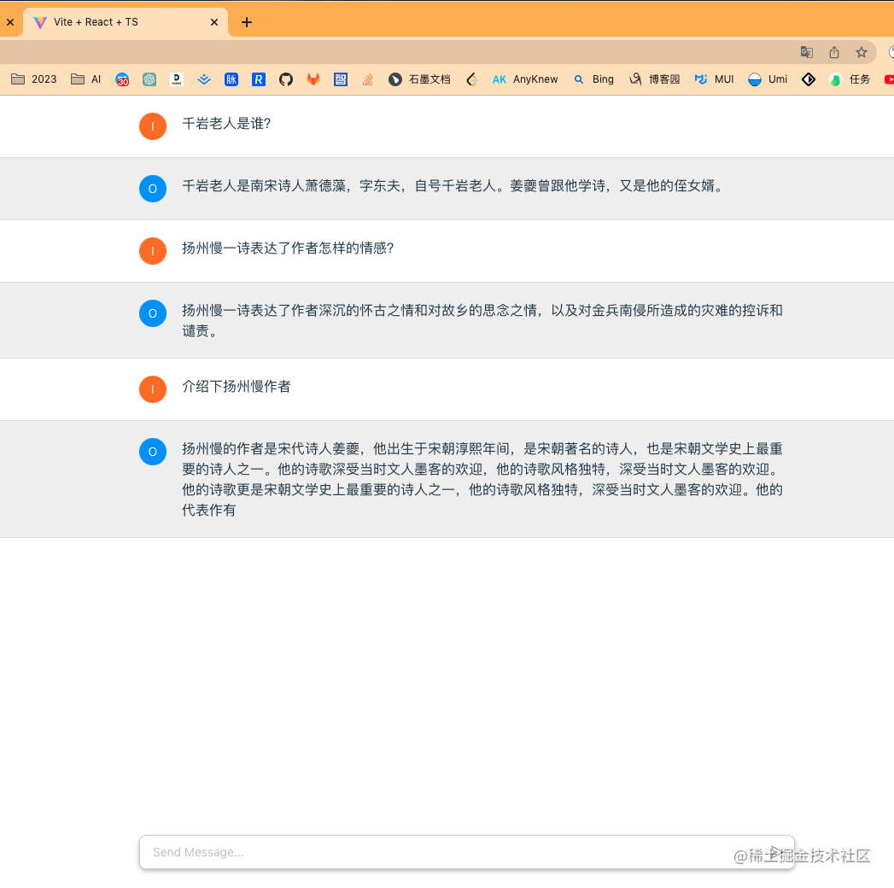

<h2 align="center">
  ChatGPT llama 🤖
</h2>

基于llama_index的可扩展chatGPT，前端用react搭建，后端用python写的接口，主要是用了llama_index仓库，在google的doc中上传上下文，扩展chatGPT，自定义LLM

## 前言
在当今数字时代，聊天机器人已经成为了许多企业和个人的不可或缺的工具。那么，如何构建一个高效、准确的聊天机器人呢？本文将介绍如何使用自定义知识库和OpenAI的GPT模型来构建自己的ChatGPT。

chatGPT对很多问题会有自己「独特」的见解，尤其是对于中文输入而言。比如：



本项目通过基于llamaIndex库，将自己的数据和 LLM 结合，得到更适合自己的模型。比如，我们可以把一本书通过 LlamaIndex 喂给 ChatGPT， 得到的模型里就有了我们最近喂进去的知识，然后我们可以再用自然语言向 ChatGPT 提问，就会得到包含了新知识的答案。据实测结果，它对新知识的理解归纳总结能力都很强。

先来看下最终的效果：

当我们直接向chatGPT提问关于宋代姜夔诗人所写的**扬州慢**这首诗相关的问题时，会有好多回答的错误：


可以看到有很多错误的地方，比如姜夔是宋代诗人，千岩老人是巫师等错误。  

----
对比下我们的项目。  
训练模型内容如下：


使用项目训练后结果如下：


可以看到，内容基本准确，且基于训练模型可以进一步扩展出相关的内容。这让人感到一扇新的大门正在打开。这个方案可能能够替代几乎所有的说明书、客服，甚至一些高阶职位。


# 技术栈

### Backend
  - Python
  - openai
  - llama-index
  - google-auth-oauthlib

### Frontend
  - React
  - Javascript


### 使用方法

###  Backend
获取openAPI、google文档的key、google文件的json
```sh
$ cd server
$ pip install openai==0.27.2  
$ pip install llama-index==0.4.28  
$ pip install google-auth-oauthlib==1.0.0
$ pip install flask
$ pip install flask_cors
$ python api.py
```

###  frontend
```sh
$ cd web
$ yarn install
$ yarn dev
```
若无法启动，可查看 [https://juejin.cn/post/7225516440090165303](https://juejin.cn/post/7225516440090165303)

### 后期计划
- [-] 语音输入
- [-] 语音播报
- [ ] 结果文字流式显示
- [ ] 支持更换主题色
- [ ] 左侧框完善